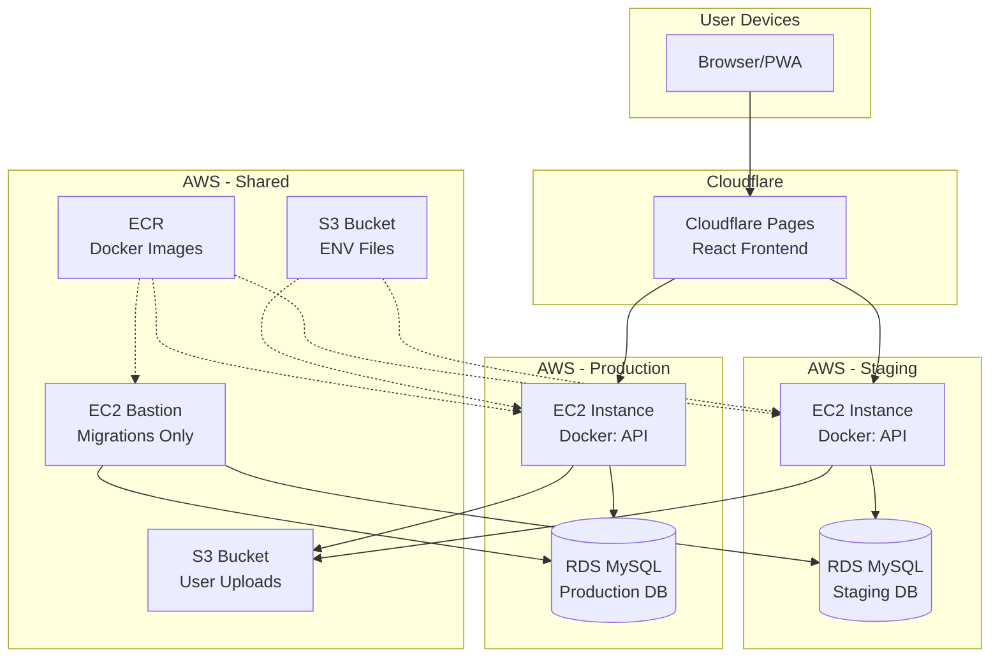

# Architecture: Isolated Components for Safe Deployments

> The core principle: **each component deploys independently, so failures are isolated**.

---

## High-Level Overview



---

## Component Breakdown

### 1. Frontend (Cloudflare Pages)

```
┌─────────────────────────────────────────────────────────────────┐
│                      FRONTEND DEPLOYMENT                        │
├─────────────────────────────────────────────────────────────────┤
│                                                                 │
│   GitHub Repository                                             │
│   (tipntap-frontend)                                            │
│         │                                                       │
│         │  Push to main                                         │
│         ▼                                                       │
│   ┌─────────────────────────────────────────────────────────┐  │
│   │              Cloudflare Pages                           │  │
│   │  • Detects push automatically                           │  │
│   │  • Runs npm build                                       │  │
│   │  • Deploys to global CDN                                │  │
│   │  • ~30 seconds total                                    │  │
│   └─────────────────────────────────────────────────────────┘  │
│         │                                                       │
│         ▼                                                       │
│   ┌─────────────────────────────────────────────────────────┐  │
│   │  Preview URL: abc123.tipntap.pages.dev (per commit)     │  │
│   │  Production:  app.tipntap.fr                            │  │
│   └─────────────────────────────────────────────────────────┘  │
│                                                                 │
└─────────────────────────────────────────────────────────────────┘
```

**Why Cloudflare Pages:**

| Criteria | Cloudflare Pages | AWS (S3 + CloudFront) |
|----------|------------------|----------------------|
| Setup time | 5 minutes | 2-3 hours |
| Config needed | Zero | SSL, distributions, buckets |
| Cost at our scale | $0 | $5-20/month |
| Deploy speed | ~30 seconds | 2-5 minutes |
| Preview URLs | Automatic per branch | Manual setup |

**Trade-off:** Less control. But for a React SPA, we don't need control—we need speed and reliability.

---

### 2. Backend API (AWS EC2 + Docker)

```
┌─────────────────────────────────────────────────────────────────┐
│                      BACKEND DEPLOYMENT                         │
├─────────────────────────────────────────────────────────────────┤
│                                                                 │
│   GitHub Repository                                             │
│   (tipntap-backend)                                             │
│         │                                                       │
│         │  Push to main ──────────► Staging                     │
│         │  Push to production ────► Production                  │
│         ▼                                                       │
│   ┌─────────────────────────────────────────────────────────┐  │
│   │              GitHub Actions                             │  │
│   │                                                         │  │
│   │  1. Checkout code                                       │  │
│   │  2. Build Docker image (multi-stage)                    │  │
│   │  3. Push to AWS ECR                                     │  │
│   │  4. SSM command to EC2:                                 │  │
│   │     a. Pull .env from S3                                │  │
│   │     b. Pull new image from ECR                          │  │
│   │     c. Stop old container                               │  │
│   │     d. Start new container                              │  │
│   │     e. Health check                                     │  │
│   └─────────────────────────────────────────────────────────┘  │
│                                                                 │
└─────────────────────────────────────────────────────────────────┘
```

**Why This Approach:**

| Decision | Rationale |
|----------|-----------|
| **Docker** | Consistent environment between dev/staging/prod |
| **EC2 vs ECS/Fargate** | Simpler mental model, predictable costs |
| **SSM vs SSH** | No SSH keys to manage, audit trail |
| **Separate instances** | Staging issues can't affect production |

**The Branch Strategy:**

```
main branch ──────────────────► Staging EC2
                                    │
                                    │ Manual merge after testing
                                    ▼
production branch ────────────► Production EC2
```

This ensures:
1. Every commit to `main` auto-deploys to staging
2. Production only updates when we explicitly merge
3. Clear audit trail of what's in production

---

### 3. Database Migrations (Bastion EC2)

```
┌─────────────────────────────────────────────────────────────────┐
│                    MIGRATIONS DEPLOYMENT                        │
├─────────────────────────────────────────────────────────────────┤
│                                                                 │
│   GitHub Repository                                             │
│   (tipntap-migrations)                                          │
│         │                                                       │
│         │  Manual workflow dispatch                             │
│         │  OR push to deploy branch                             │
│         ▼                                                       │
│   ┌─────────────────────────────────────────────────────────┐  │
│   │              GitHub Actions                             │  │
│   │                                                         │  │
│   │  Inputs:                                                │  │
│   │  • command: migrate | migrate:down | migrate:status     │  │
│   │                                                         │  │
│   │  Steps:                                                 │  │
│   │  1. Build migration container                           │  │
│   │  2. Push to ECR                                         │  │
│   │  3. SSM command to Bastion EC2:                         │  │
│   │     a. Pull .env-migrations from S3                     │  │
│   │     b. Pull migration image                             │  │
│   │     c. Run container with --rm flag                     │  │
│   │     d. Container connects to RDS                        │  │
│   │     e. Runs Sequelize migration                         │  │
│   │     f. Container auto-deletes                           │  │
│   └─────────────────────────────────────────────────────────┘  │
│                                                                 │
└─────────────────────────────────────────────────────────────────┘
```

**Why a Separate Bastion:**

| Concern | Solution |
|---------|----------|
| **Security** | Bastion is the only instance that can reach RDS |
| **Isolation** | Migration failures don't crash the API |
| **Ephemerality** | Container runs once and deletes (`--rm`) |
| **Control** | Manual trigger = explicit decision to migrate |

**The `--rm` Flag Is Critical:**

```bash
# Container runs migration and immediately deletes
docker run --rm --name tipntap-migrations \
  --env-file /home/ec2-user/project/.env \
  -e COMMAND=migrate \
  $ECR_IMAGE
```

No orphaned containers. No state to clean up. Each migration is a fresh environment.

---

### 4. ENV File Management (S3)

```
┌─────────────────────────────────────────────────────────────────┐
│                     ENV FILE FLOW                               │
├─────────────────────────────────────────────────────────────────┤
│                                                                 │
│   Developer Machine                                             │
│   ├── api/.env.staging                                          │
│   ├── api/.env.production                                       │
│   └── api/.env.migrations                                       │
│         │                                                       │
│         │  node scripts/upload-env-to-s3.js                     │
│         ▼                                                       │
│   ┌─────────────────────────────────────────────────────────┐  │
│   │  CLI Prompts:                                           │  │
│   │  > Version (v1.0.0): v1.2.0                             │  │
│   │  > Environment (staging/production/migrations): staging │  │
│   └─────────────────────────────────────────────────────────┘  │
│         │                                                       │
│         ▼                                                       │
│   ┌─────────────────────────────────────────────────────────┐  │
│   │              S3 Bucket: s3envs                          │  │
│   │                                                         │  │
│   │  .env-staging-v1.0.0                                    │  │
│   │  .env-staging-v1.1.0                                    │  │
│   │  .env-staging-v1.2.0  ◄── Latest                        │  │
│   │  .env-production-v1.0.0                                 │  │
│   │  .env-migrations-v1.0.0                                 │  │
│   └─────────────────────────────────────────────────────────┘  │
│         │                                                       │
│         │  At deploy time (GitHub Actions)                      │
│         ▼                                                       │
│   aws s3 cp s3://s3envs/.env-staging-v1.0.0 /project/.env      │
│                                                                 │
└─────────────────────────────────────────────────────────────────┘
```

**Why Version ENV Files:**

| Without Versioning | With Versioning |
|-------------------|-----------------|
| "Which .env is deployed?" | Clear: `v1.2.0` is deployed |
| Rollback = guesswork | Rollback = deploy previous version |
| No audit trail | S3 shows upload history |

**The Manual Trade-off:**

Yes, I have to remember to push ENV changes. I've forgotten a few times. But:
- Staging catches the mistake before production
- I maintain full control (no accidental secret exposure)
- The workflow file defines exactly which version to use

---

## Why This Architecture Works for Early-Stage

### 1. Isolated Blast Radius

```
Frontend bug?     → Only frontend affected
Backend bug?      → Only API affected
Migration bug?    → Only DB affected (staging first)
ENV mistake?      → Caught in staging
```

No single failure cascades to other components.

### 2. Independent Deploy Velocity

```
Need to fix a typo in the UI?
→ Push frontend, deployed in 30 seconds
→ Backend untouched

Need to update API logic?
→ Push backend to staging
→ Test → Push to production
→ Frontend untouched

Need to add a DB column?
→ Run migration on staging
→ Deploy API that uses new column
→ Run migration on production
→ Done
```

### 3. Predictable Costs

| Component | Monthly Cost |
|-----------|-------------|
| Cloudflare Pages | $0 |
| EC2 Staging (t3.micro) | ~$8 |
| EC2 Production (t3.small) | ~$15 |
| EC2 Bastion (t3.micro) | ~$8 |
| RDS (db.t3.micro x2) | ~$15 |
| ECR | ~$1 |
| S3 | ~$1 |
| **Total** | **< $50/month** |

No surprises. No "oops we left a Lambda running."

---

## The Deployment Order Matters

When making changes that span multiple components:

```
┌─────────────────────────────────────────────────────────────────┐
│                    CORRECT DEPLOY ORDER                         │
├─────────────────────────────────────────────────────────────────┤
│                                                                 │
│   1. ENV files (if changed)                                     │
│      └── Upload to S3 first                                     │
│                                                                 │
│   2. Migrations (if schema changed)                             │
│      └── DB must be ready before API expects new columns        │
│                                                                 │
│   3. Backend API                                                │
│      └── API must be ready before frontend calls new endpoints  │
│                                                                 │
│   4. Frontend                                                   │
│      └── Last, because it depends on API being ready            │
│                                                                 │
└─────────────────────────────────────────────────────────────────┘
```

**This is manual orchestration.** I know what order to deploy in. The trade-off is:
- **Pro:** Full control, explicit decisions
- **Con:** Can forget a step (staging catches this)

---

## Security Considerations

| Concern | How It's Handled |
|---------|------------------|
| **Secrets in CI logs** | Never echo secrets; use GitHub Secrets |
| **Database access** | Only bastion can reach RDS (security group) |
| **SSH keys** | None—SSM handles instance access |
| **ENV files** | Not in git; versioned in private S3 bucket |
| **Docker images** | Private ECR registry |

---

[← Evolution](EVOLUTION.md) | [Back to README](../README.md) | [Workflow →](WORKFLOW.md)
